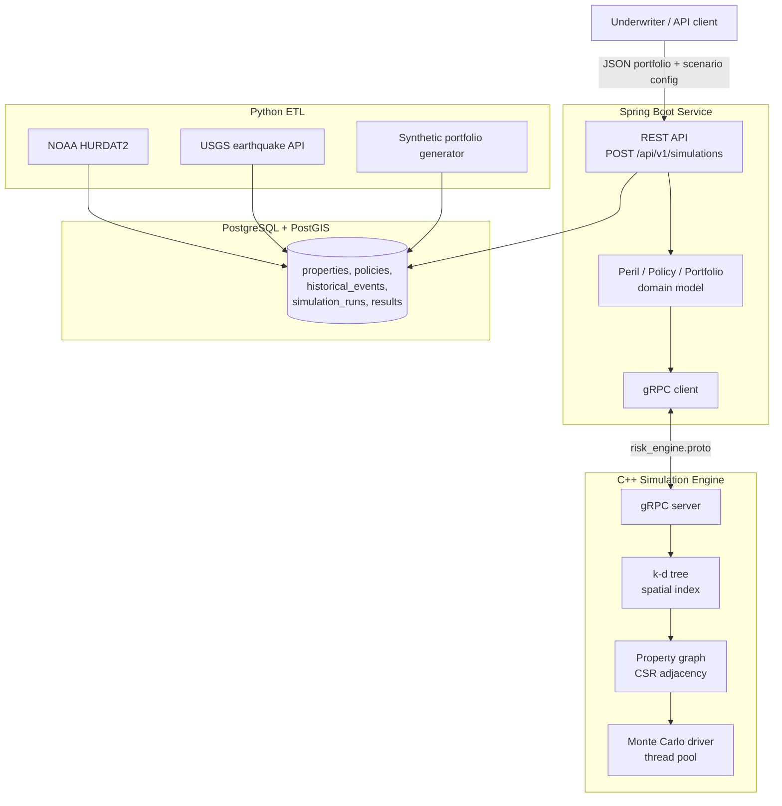

# Catastrophic Risk Simulation Engine

A P&C insurance catastrophe risk modeling platform: Monte Carlo simulation over a property
portfolio, propagating spatially correlated damage probability outward from an event epicenter
across a graph of properties, returning portfolio-level loss distributions (expected loss, p99
tail risk).

## Architecture



`engine/proto/risk_engine.proto` is the single source of truth for the wire schema — both the
C++ server and the Java client generate their stubs from it.

## Repository layout

```
engine/          C++ simulation core: k-d tree, property graph, Monte Carlo, gRPC server
  proto/         risk_engine.proto — shared wire schema
  tests/         Catch2 unit tests
  apps/cli/      benchmark + Monte Carlo demo binary
  apps/server/   gRPC server + a real-client smoketest
service/         Spring Boot REST API + domain model + gRPC client
db/              Flyway migrations (V1__init_schema.sql) + a DB-only docker-compose for local ETL work
etl/             Python ETL: real NOAA HURDAT2 + USGS data, synthetic portfolio generator
infra/
  docker/        Dockerfiles for the engine and service images
  DEPLOYMENT.md  AWS ECS scaling design (not deployed live)
.github/workflows/ci.yml   Linux + Windows CI matrix
docker-compose.yml         full local stack: Postgres -> Flyway -> engine -> service
```

## Status

Built through Step 7 of the original 9-step plan. **Step 8 (LLM-generated underwriter summaries)
was explicitly dropped** — not a placeholder, a deliberate scope cut. Everything below is real and
tested, not stubbed:

| Step | What | Status |
|---|---|---|
| 1 | C++ spatial index (k-d tree) + tests | Done |
| 2 | Graph propagation + Monte Carlo + tests | Done |
| 3 | gRPC interface | Done |
| 4 | Postgres schema + real NOAA/USGS ETL + synthetic portfolio | Done |
| 5 | Spring Boot domain model + REST API | Done |
| 6 | CI (Linux + Windows matrix) | Done, green on GitHub Actions |
| 7 | Docker Compose full stack + AWS ECS deployment doc | Done |
| 8 | LLM summary layer | Skipped by design |
| 9 | This README | Done |

Known limitation: the Testcontainers-backed `SimulationControllerIntegrationTest` doesn't run
under Docker Desktop on Windows (a docker-java/Docker-Desktop-on-Windows compatibility issue, not
a bug in the test) — it passes on the Linux CI runner, where Docker is native. The CI workflow
runs it only on `ubuntu-latest` for exactly this reason.

## Running it locally

**Prerequisites:** CMake 3.20+, a C++20 compiler, Java 21 (or let the Maven wrapper resolve it),
Docker Desktop, Python 3.11+.

### 1. C++ engine — build and test

```
cmake -S engine -B engine/build -DCMAKE_BUILD_TYPE=Release
cmake --build engine/build --config Release
ctest --test-dir engine/build --build-config Release --output-on-failure
```

To also build the gRPC server (`risk_engine_server`), configure with a vcpkg toolchain on Windows
(`-DCMAKE_TOOLCHAIN_FILE=<vcpkg>/scripts/buildsystems/vcpkg.cmake`, after `vcpkg install
grpc:x64-windows`) — on Linux it just needs `apt install libgrpc++-dev libprotobuf-dev
protobuf-compiler-grpc protobuf-compiler`. Without either, CMake skips that target cleanly and
everything else still builds.

### 2. Full stack via Docker Compose

```
docker compose up --build
```

Brings up Postgres+PostGIS, applies the Flyway migration, and starts both the gRPC engine and the
Spring Boot API. The REST API is then live at `http://localhost:8080`.

### 3. Load real historical data + a synthetic portfolio

```
cd etl
python -m venv .venv && .venv/Scripts/pip install -r requirements.txt   # or .venv/bin/pip on Linux/macOS
python run_etl.py --all
```

### 4. Submit a portfolio

```
curl -X POST http://localhost:8080/api/v1/simulations \
  -H "Content-Type: application/json" \
  -d '{
    "perilType": "hurricane",
    "masterSeed": 42,
    "numScenarios": 10000,
    "properties": [
      {"lat": 25.7617, "lon": -80.1918, "insuredValue": 500000},
      {"lat": 27.9506, "lon": -82.4572, "insuredValue": 750000}
    ]
  }'
```

## Sample output from actual runs

**C++ engine, k-d tree vs. brute-force benchmark** (`engine/apps/cli`):

```
N=10000, 200 queries, radius=10.0
  KDTree:      0.150 ms total (573 matches summed)
  Brute force: 2.631 ms total (573 matches summed)
  Speedup:     17.6x

N=100000, 200 queries, radius=10.0
  KDTree:      1.583 ms total (6311 matches summed)
  Brute force: 20.587 ms total (6311 matches summed)
  Speedup:     13.0x
```

**C++ engine, Monte Carlo run** — the literal "I ran N simulations" artifact, 500 synthetic
properties, real thread pool, real wall-clock time:

```
Scenarios executed: 10000
Threads used:       14
Wall clock:         23.80 ms
Mean loss:          $246090.43
P99 loss:           $962805.22
Min loss:           $19555.65
Max loss:           $1767487.24
```

**Python ETL, real NOAA/USGS data loaded into Postgres:**

```
historical_events (hurricane)    3587   -- real NOAA HURDAT2 track points, 2020-2025
historical_events (earthquake)    306   -- real USGS events, magnitude >= 4.0
properties                       8000   -- synthetic portfolio
```

Cross-checked that the real and synthetic data actually overlap spatially: a real 2020 storm
(AL192020) has track points as close as 17.9 km from the synthetic Miami-area property cluster.

**Full stack, REST API → gRPC → C++ engine → Postgres, all in Docker containers:**

```
$ curl -X POST http://localhost:8080/api/v1/simulations ...
{"perilType":"earthquake","scenarioCount":10000,"meanLoss":659708.26,
 "p99Loss":1187635.65,"minLoss":270039.57,"maxLoss":1199988.09,
 "wallClockMs":16.05,"threadsUsed":14}
```

Confirmed persisted in Postgres with matching values via `docker exec ... psql`.

**CI**: green on both `ubuntu-latest` and `windows-latest` —
[run 35426611522](https://github.com/asherkamal/risk-engine/actions/runs/35426611522).

## Design notes worth knowing for a walkthrough

- **k-d tree over R-tree** for the spatial index: properties are zero-extent points, and the query
  is "points within radius X of point Y" — a bounded range query k-d trees prune natively.
  R-trees earn their bounding-box machinery for *extent* data, which doesn't apply here.
- **Per-thread-local Monte Carlo accumulation, merged after join** instead of a mutex-guarded
  shared accumulator: no shared mutable state exists during the parallel phase at all, so there's
  no lock contention to reason about. Results are canonicalized by scenario index before reducing
  (not by thread/completion order), because floating-point addition isn't associative — this is
  what makes results bit-identical regardless of thread count (see
  `engine/tests/test_monte_carlo.cpp`).
- **Real polymorphism in the domain model**: `SimulationService` calls
  `peril.buildSimulationConfig(...)` through the `Peril` base class only — never branches on peril
  type. `PerilTest` asserts this directly by iterating `List<Peril>`.
- **gRPC toolchain differs by OS on purpose**: vcpkg on Windows (no system package manager
  equivalent), apt on Linux (Debian ships prebuilt gRPC/Protobuf packages) — `engine/CMakeLists.txt`
  gates the server target behind `find_package(gRPC CONFIG QUIET)` so the core engine and its
  tests build identically either way, with or without gRPC available.
