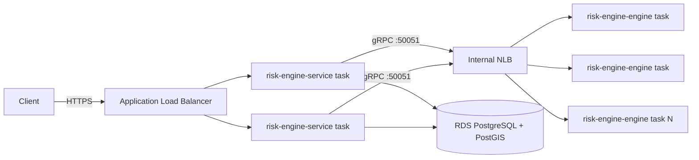

# Deployment: AWS ECS

This describes how the stack would run on AWS ECS as horizontally scalable
services. **Not deployed live** — no Terraform apply has been run against a
real AWS account, and this doc doesn't assume one exists. It exists so the
scaling story ("more workers = more parallel Monte Carlo scenarios") has a
concrete, reviewable design, consistent with the ground rule that nothing
here should look finished when it isn't: this is a design, not a running
system.

## Architecture



Two independently scaled ECS services, matching the two Dockerfiles already
built in Step 7 (`infra/docker/Dockerfile.engine`, `Dockerfile.service`):

- **risk-engine-service** (Spring Boot, public-facing): behind an
  Application Load Balancer, terminating TLS. Scales on request concurrency
  — this is a thin orchestration layer (submit portfolio, call the engine,
  persist the result), so it doesn't need many replicas to handle load; 2
  tasks for availability is the realistic baseline.
- **risk-engine-engine** (C++ gRPC server): the actual compute. This is
  where "more workers = more parallel Monte Carlo scenarios" lives —
  each task runs its own thread pool (Step 2's `RunMonteCarlo`), so ECS
  horizontal scaling and in-process thread scaling compose: N tasks × M
  threads per task = total parallel scenario throughput. Sits behind an
  internal Network Load Balancer (gRPC is HTTP/2; ALB supports HTTP/2 too,
  but an internal NLB keeps this path off the public listener entirely).

Database: RDS for PostgreSQL with the PostGIS extension enabled, not a
self-hosted container — stateful, not something ECS should be scaling or
rescheduling.

## Task definitions (sketch)

Both are Fargate tasks (no EC2 fleet to manage for a portfolio-scale
project) built from the same images `docker-compose.yml` already builds
locally:

```jsonc
// risk-engine-engine task definition (excerpt)
{
  "family": "risk-engine-engine",
  "cpu": "1024",       // 1 vCPU
  "memory": "2048",    // 2 GB — thread pool + per-scenario scratch buffers
  "containerDefinitions": [{
    "name": "engine",
    "image": "<ecr-repo>/risk-engine-engine:latest",
    "portMappings": [{ "containerPort": 50051, "protocol": "tcp" }],
    "environment": []   // stateless: no DB/env config needed, see main.cpp
  }]
}
```

```jsonc
// risk-engine-service task definition (excerpt)
{
  "family": "risk-engine-service",
  "cpu": "512",
  "memory": "1024",
  "containerDefinitions": [{
    "name": "service",
    "image": "<ecr-repo>/risk-engine-service:latest",
    "portMappings": [{ "containerPort": 8080, "protocol": "tcp" }],
    "environment": [
      { "name": "SPRING_DATASOURCE_URL", "value": "jdbc:postgresql://<rds-endpoint>:5432/riskengine" },
      { "name": "RISK_ENGINE_GRPC_HOST", "value": "<internal-nlb-dns-name>" },
      { "name": "RISK_ENGINE_GRPC_PORT", "value": "50051" }
    ],
    "secrets": [
      { "name": "SPRING_DATASOURCE_PASSWORD", "valueFrom": "<secrets-manager-arn>" }
    ]
  }]
}
```

Note the parallel to `docker-compose.yml`'s `environment:` block for the
`service` container — same variables, same relaxed-binding property names,
just pointed at RDS and an internal NLB DNS name instead of the compose
service names `postgres`/`engine`.

## Scaling policy

`risk-engine-engine`'s ECS service uses **target tracking on CPU
utilization** (target: 60-70%) as the primary signal — Monte Carlo
scenarios are CPU-bound (Step 2's thread pool saturates available cores),
so sustained high CPU is a direct proxy for "more scenario throughput is
needed." `min_capacity: 2`, `max_capacity` sized to the account's Fargate
vCPU quota. `risk-engine-service` scales the same way but with a lower CPU
target (it's I/O-bound waiting on the engine's gRPC response, not compute-
heavy itself) or on ALB request count per target, whichever proves more
stable in practice.

## What's deliberately not here

- No live Terraform state, no VPC/subnet/IAM definitions — writing those
  without a real AWS account to validate them against would be exactly the
  kind of "looks finished but isn't actually verified" artifact the ground
  rules for this project rule out.
- No CI/CD pipeline pushing images to ECR on merge — a natural Step-6
  extension, not built here.
- No autoscaling based on a custom "pending simulation requests" metric,
  even though that would arguably track load better than CPU for the
  engine service — CPU-based target tracking is the standard, immediately
  available ECS primitive; a custom CloudWatch metric would need the
  service layer to publish queue depth first, which doesn't exist yet.
